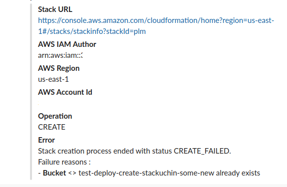

# stackuchin

## What is Stackuchin?

It's a CLI tool developed by [Rungutan](https://rungutan.com) and designed to automatically create, update and delete CloudFormation stacks in multiple AWS accounts and regions at the same time.


## Why use the CLI?

This CLI has been designed for:
1) versioning AWS CloudFormation parameters in GIT
2) deploying to multiple AWS accounts or AWS regions either in PARALLEL or SEQUENTIAL
3) send notifications to Slack channels with AWS errors based on operation
4) support **create**, **update** and **delete** commands
5) can be ran either manually or through a pipeline definition in your CI/CD system
6) supports both AWS normal CloudFormation templates as well AWS SAM templates
7) supports parent/child stacks
8) it supports NoEcho parameters
9) it supports tagging of resources at stack level
10) it supports unattended deployment (through a CI/CD system)

And this is just the tip of the iceberg...

## What can this CLI NOT do?

Unfortunately, it cannot understand contracted forms of verbs in AWS CloudFormation.

In short, you'll have to rename `!If` commands to `Fn::If`.

## Is it production ready?

We, at [Rungutan](https://rungutan.com), in order to support global concurrency for load testing and ensure high availability as well, have around 200 stacks on average deployed in each and every of the 15 regions our platform currently supports.

In short, yes, we use **Stackuchin** to handle updates for around 3000 AWS CloudFormation stacks.

And no, we're not exagerating or bumping the numbers :-)

## What are the normal use cases?

If simply the fact that you can now git-version all your stacks AND their stack parameters, isn't enough, then:
* your developers can now manage AWS CloudFormation stack themselves, WITHOUT needing to have any "write" IAM permissions
* you can use CI/CD for automated deployments
* you can use pull requests to review parameter/stack changes

## How to install the CLI?

```shell script
pip install stackuchin
```

## How to run the CLI?

* Check the overall help menu

```shell script
$ stackuchin help

usage: stackuchin <command> [<args>]

To see help text, you can run:
    stackuchin help
    stackuchin version
    stackuchin create --help
    stackuchin delete --help
    stackuchin update --help
    stackuchin pipeline --help

CLI tool to automatically create, update and delete AWS CloudFormation stacks in multiple AWS accounts and regions at the same time

positional arguments:
  command     Command to run

optional arguments:
  -h, --help  show this help message and exit

```

* Check the help menu for a specific command

```shell script
$ stackuchin create --help

usage: stackuchin [-h] [--stack_file STACK_FILE] --stack_name STACK_NAME [--secret Parameter=Value] [--slack_webhook SLACK_WEBHOOK] [--s3_bucket S3_BUCKET] [--s3_prefix S3_PREFIX] [-p PROFILE]

Create command system

optional arguments:
  -h, --help            show this help message and exit
  --stack_file STACK_FILE
                        The YAML file which contains your stack definitions.
                        Defaults to "./cloudformation-stacks.yaml" if not specified.
  --stack_name STACK_NAME
                        The stack that you wish to create
  --secret Parameter=Value
                        Argument used to specify values for NoEcho parameters in your stack
  --slack_webhook SLACK_WEBHOOK
                        Argument used to overwrite environment variable STACKUCHIN_SLACK.
                        If argument is specified, any notifications will be sent to this URL.
                        If not specified, the script will check for env var STACKUCHIN_SLACK.
                        If neither argument nor environment variable is specified, then no notifications will be sent.
  --s3_bucket S3_BUCKET
                        Argument used to overwrite environment variable STACKUCHIN_BUCKET_NAME.
                        If argument is specified, then the template is first uploaded here before used in the stack.
                        If not specified, the script will check for env var STACKUCHIN_BUCKET_NAME.
                        If neither argument nor environment variable is specified, then the script will attempt to feed the template directly to the AWS API call, however, due to AWS CloudFormation API call limitations, you might end up with a bigger template in byte size than the max value allowed by AWS.
                        Details here -> https://docs.aws.amazon.com/AWSCloudFormation/latest/UserGuide/cloudformation-limits.html
  --s3_prefix S3_PREFIX
                        Argument used to overwrite environment variable STACKUCHIN_BUCKET_PREFIX.
                        The bucket prefix path to be used when the S3 bucket is defined.
  -p PROFILE, --profile PROFILE
                        The AWS profile you'll be using.
                        If not specified, the "default" profile will be used. 
                        If no profiles are defined, then the default AWS credential mechanism starts.

```

## Running it as a pipeline

```shell script

cat > input.yaml <<EOL

pipeline:
  update:
    - stack_name: TestUpdateStack
  delete:
    - stack_name: TestDeleteStack
  create:
    - stack_name: TestCreateStack
      secrets:
        - Name: SomeSecretName
          Value: SomeSecreValue
EOL

stackuchin  pipeline --pipeline_file input.yaml

```

## Get alerts in Slack

Use the environment variable `STACKUCHIN_SLACK` or the argument `--slack_webhook` to specify a Slack incoming webhook to push your alerts.

You get notified **ALL** with **PROPER MESSAGES**, so that you wouldn't need to have to open your AWS Console to fix your stuff.

Here's a sample:

 


## Notes

* Using secrets (NoEcho) parameters

Defining them as parameters kinda defeats their purpose of being secret.

You should specify them through the `--secret` argument for simple commands, or through the `secrets` property in pipelines.

* The pipeline, if "sequential", will execute the following operations in order:
You can specify only 1, 2 or 3 types of operations mentioned above, but regardless of their order, the script will forcefully process them as:
1) CREATE
2) UPDATE
3) DELETE 

* The pipeline, if "parallel", will execute ALL operations at the same time.

* Due to AWS CloudFormation limitations, a template cannot be supplied as string to the API call if it goes over a certain value in bytes.

https://docs.aws.amazon.com/AWSCloudFormation/latest/UserGuide/cloudformation-limits.html

For that, you can use the arguments `--s3_bucket` / `--s3_prefix` (or their respective environment variable equivalents`STACKUCHIN_BUCKET_NAME` / `STACKUCHIN_BUCKET_PREFIX`) to specify an intermediate place where to upload the cloudformation template before using it in the API call.

The command will work without supplying these values, but it is recommended that you use them so that you don't encounter any non-necessary errors.